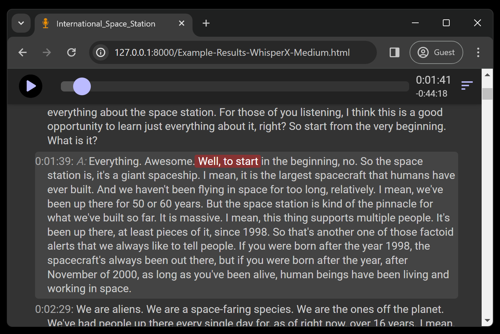

# Podcast To Text

This is a utility to turn a MP3 file into a HTML page with a machine generated transcription that looks like this:

While this is still a WIP, please check out [`usage.md`](usage.md) for more details on how to run this end to end, along 
with creating a search page [like this example](https://seligman.github.io/podcasts/houston_we_have_a_podcast/houston_we_have_a_podcast.html).

Supported engines:

* [AWS Transcribe](https://aws.amazon.com/transcribe/) -- [Sample output](https://seligman.github.io/podcast_to_text/Example-Results-AWS-Transcribe.html)
* [OpenAI Speech to Text](https://platform.openai.com/docs/guides/speech-to-text) -- [Sample output](https://seligman.github.io/podcast_to_text/Example-Results-OpenAI.html)
* [Whisper](https://github.com/openai/whisper) -- Sample output: [Tiny](https://seligman.github.io/podcast_to_text/Example-Results-Whisper-Tiny.html), [Large](https://seligman.github.io/podcast_to_text/Example-Results-Whisper-Large.html) models
* [Whisper.cpp](https://github.com/ggerganov/whisper.cpp) -- Sample output: [Tiny](https://seligman.github.io/podcast_to_text/Example-Results-Whisper_CPP-Tiny.html), [Large](https://seligman.github.io/podcast_to_text/Example-Results-Whisper_CPP-Large.html) models
* [Whisper-Timestamped](https://github.com/linto-ai/whisper-timestamped) -- Sample output: [Medium](https://seligman.github.io/podcast_to_text/Example-Results-WhisperTimestamped-Medium.html) model.
* [WhisperX](https://github.com/m-bain/whisperX) -- Sample output: [Medium](https://seligman.github.io/podcast_to_text/Example-Results-WhisperX-Medium.html) model.
