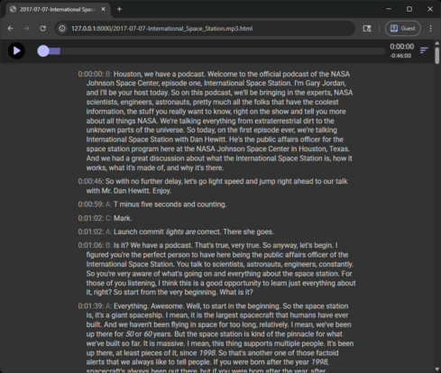
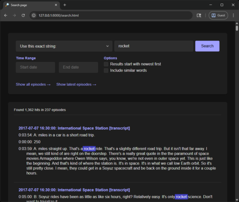
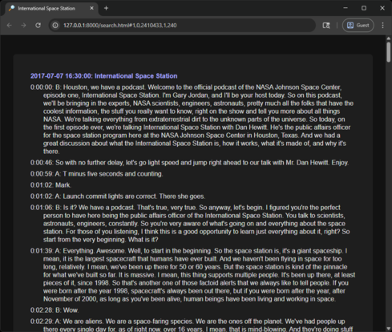

# Search a Podcast Feed

These instructions allow you to automate downloading all of the episodes from a podcast feed using the RSS feed, transcribing the feed, and create the data files for a webpage to search the transcripts.

## Setup

For the transcription itself to run here, you will need to setup an environment variable `HF_TOKEN` with your [Hugging Face token](https://huggingface.co/docs/hub/en/security-tokens):

```text
@rem For Windows:
set HF_TOKEN=[the token from Hugging Face]

# For Linux and macOS:
export HF_TOKEN=[the token from Hugging Face]
```

You'll also need to ensure [WhisperX](https://github.com/m-bain/whisperX) is installed in your Python Packages.  Note that this may require a specific version of Python, I've tested these instructions with Python 3.10.  You can use [Anaconda](https://www.anaconda.com/docs/getting-started/anaconda/install#linux-installer) to install a specific Python version side-by-side with other installations.

It's also possible to run these directions in Docker, though care must be taken to pass through the GPU to the container, and note that especially on Windows, Docker will not pass the GPU to the container during a build, which might impact how the models are downloaded and configured during the initial build.

## Downloading and transcribing a feed

Once setup, you can run 

```bash
python transcribe_feed.py [path]
```

Where `[path]` is the path to store the MP3 files and metadata.

Optionally, you can create a .json file with the same format described as the `DEFAULT_SETTINGS` variable in `transcribe_feed.py` and pick a different transcription engine and/or model to process the audio files.

The first time transcribe feed is run, it will prompt for some information:

```text
$ python transcribe_feed.py ~/pod_example
Enter podcast RSS feed URL: https://www.nasa.gov/feeds/podcasts/houston-we-have-a-podcast
Enter filename of settings file for Engine override (blank for none):
URL: https://www.nasa.gov/feeds/podcasts/houston-we-have-a-podcast
Engine: (Use default)
Does this look ok? [y/(n)] y
```

This will store these settings in a `settings.json` file for future runs.

From there, it will download all MP3 files from the podcast, and then start transcribing the podcast, creating a `.json.gz` file for each episode, along with a `.html` player for the episode.  It stores the data about each episode and some other metadata in a file called `cache.json`.

The command is safe to run again, it will only download MP3 files and update the metadata file for items that have not been previously processed.

Note that this process will take some time to run, generally a couple of minutes per episode, more if running on a CPU.  You can create a file called `abort.txt` to have the process cleanly stop during a run.  Also note that the WhisperX process will generate several warnings about version compatibility issues.  This is expected.

When run to completion, this will download the MP3 files, and create a metadata file with the transcript and a webpage player for each episode.  The webpages can be run with almost any web server, or just run from the local filesystem:

[  ](search/preview_player.png)

## Creating a search database

You can run the following to create a search database:

```bash
python make_search_page.py [path]
```

Where `[path]` is the local path that was used in the previous step.

## Running the example server

While the `search.html` page that's created can be served up with almost almost any server, it will not work from a file system, since most modern browsers block Javascript from loading local files.  What's more, it also won't work with Python's built in "http.server" since that does not support byte-range requests.  This project includes a simple example server written in Python that will work:

```bash
cd [path]
python "[path to this repo]/examples/example_server.py"
```

Where `[path]` is again the local path that was used to store data, and `[path to this repo]` is the path to this repo on your local machine.  When run, visit `http://127.0.0.1:8000/search.html` in your local browser to view the search page:

[  ](search/preview_search.png)

[  ](search/preview_result.png)

Once the data is loaded, all searching will occur in your browser itself.
